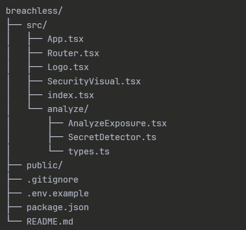

# Breachless - Secret Exposure Analyzer

<div align="center">
  
**Awareness before compromise.**

A modern web application that detects hardcoded secrets in your code before they leak to production.

[Live Demo](https://breachless.onrender.com/) | [Features](#features) | [Getting Started](#getting-started)

</div>

---

## What is Breachless?

Breachless is a secret detection tool that helps developers identify exposed credentials, API keys, and sensitive data in their code before committing to version control. Paste your code, upload files, or scan entire folders to get instant feedback on potential security vulnerabilities.

## Features

### Comprehensive Secret Detection
Detects 14+ types of secrets including:
- AWS Access & Secret Keys
- GitHub Personal Access Tokens
- Stripe API Keys
- Database Connection Strings
- JWT Tokens
- Private Cryptographic Keys
- And more...

### Multiple Scanning Options
- **Paste Code** - Quick analysis by pasting code snippets
- **Upload Files** - Scan multiple files at once
- **Upload Folder** - Recursively scan entire project folders

### Risk Analysis
- Real-time scanning with severity levels (Critical, High, Medium, Low)
- Line-by-line detection with masked previews
- Overall risk assessment
- File-by-file breakdown for multi-file scans

### Educational Guidance
- Plain-English explanations of what each secret does
- Step-by-step remediation instructions
- Links to security best practices
- How to use environment variables properly

### Authentication System
- User registration and login
- Role-based access (Admin, Staff, User)
- Firebase Authentication integration
- Secure dashboard access

### Admin Dashboard
- View all contact form submissions
- Track user analytics and usage statistics
- Monitor secrets revealed count
- Manage response status

### Modern UI
- Clean, dark-themed interface
- Animated 3D graphics with Three.js
- Responsive design
- Smooth transitions and effects

## Getting Started

### Prerequisites
- Node.js (v16 or higher)
- npm or yarn
- Firebase account (for authentication)

### Installation

1. Clone the repository
```bash
git clone https://github.com/Vaishnavi19mdu/breachless.git
cd breachless
```

2. Install dependencies
```bash
npm install
```

3. Set up Firebase
```bash
# Create .env.local file with your Firebase config
VITE_FIREBASE_API_KEY=your_api_key
VITE_FIREBASE_AUTH_DOMAIN=your_project.firebaseapp.com
VITE_FIREBASE_PROJECT_ID=your_project_id
VITE_FIREBASE_STORAGE_BUCKET=your_project.appspot.com
VITE_FIREBASE_MESSAGING_SENDER_ID=your_sender_id
VITE_FIREBASE_APP_ID=your_app_id
```

4. Run the development server
```bash
npm run dev
```

5. Open your browser and navigate to http://localhost:3000

## Project Structure



## How to Use

### For Regular Users

#### Paste Code
1. **Sign Up** - Create an account with email and password
2. **Navigate to Analyzer** - Click "Analyze Exposure" button
3. **Select "Paste Code"** - Choose the paste code option
4. **Paste Your Code** - Copy code from .env files or scripts
5. **Run Analysis** - Click "Analyze Code"
6. **Review Results** - See detected secrets with remediation guides

#### Upload Files
1. **Navigate to Analyzer**
2. **Select "Upload Files"** - Choose the file upload option
3. **Select Multiple Files** - Upload multiple code files at once
4. **View Results** - See secrets detected in each file

#### Upload Folder
1. **Navigate to Analyzer**
2. **Select "Upload Folder"** - Choose the folder upload option
3. **Select Project Folder** - Upload entire project directory
4. **View Results** - See a complete scan of all files with secrets

### For Admin/Staff
1. **Login** - Use your credentials
2. **Access Dashboard** - View contact submissions and analytics
3. **Manage Queries** - Respond to user queries
4. **Monitor Usage** - Track secrets revealed and user activity

## Tech Stack

- **Frontend**: React 19 + TypeScript
- **Styling**: Tailwind CSS
- **3D Graphics**: Three.js
- **Authentication**: Firebase Auth
- **Database**: Firebase Firestore
- **Routing**: React Router v6
- **Build Tool**: Vite
- **Deployment**: Render

## Development

### Available Scripts

- `npm run dev` - Start development server
- `npm run build` - Build for production
- `npm run preview` - Preview production build

### User Roles

- **User**: Can use the secret analyzer tool
- **Staff**: Can view and respond to contact queries
- **Admin**: Full access to analytics and user management

To promote a user to admin:
1. Go to Firebase Console → Firestore
2. Find the user document in `users` collection
3. Change `role` field from `staff` to `admin`

## Deployment

The app is deployed on Render.

Live at: https://breachless.onrender.com/

## Contributing

Contributions are welcome! Please feel free to submit a Pull Request.

1. Fork the repository
2. Create your feature branch (`git checkout -b feature/AmazingFeature`)
3. Commit your changes (`git commit -m 'Add some AmazingFeature'`)
4. Push to the branch (`git push origin feature/AmazingFeature`)
5. Open a Pull Request

## License

This project is licensed under the MIT License.

## Security Note

This tool performs **client-side analysis only**. Your code never leaves your browser. However, always practice proper secret management:

- Use environment variables (.env files)
- Add .env to .gitignore
- Rotate compromised credentials immediately
- Use secret management tools (AWS Secrets Manager, HashiCorp Vault)
- Enable Firebase Security Rules to protect your database

## Acknowledgments

- Built with React and Firebase
- UI inspired by modern security tools
- Secret detection patterns based on industry standards

---

<div align="center">

Made with 🛡️ by the Breachless Team

[Report Bug](https://github.com/Vaishnavi19mdu/breachless/issues) • [Request Feature](https://github.com/Vaishnavi19mdu/breachless/issues)

</div>